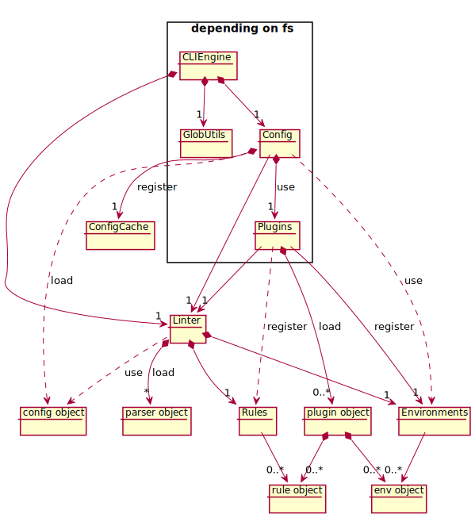
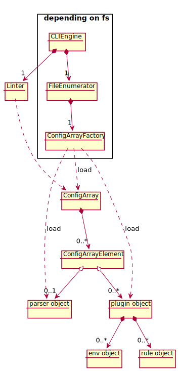

- Start Date: 2019-02-25
- RFC PR: https://github.com/eslint/rfcs/pull/13
- Authors: Toru Nagashima (@mysticatea)

# Config File Improvements

## Summary

This proposal improves our configuration files. This changes the architecture of configuration files to maintain our codebase easier and make enhancing easier.

This RFC fixes two bugs I found while I make a PoC. I guess we don't want to make surprised behaviors on purpose.

- ([link](#fix-error-in-unused-deps)) Even if unused dependencies have some errors, ESLint doesn't throw it. (fixes <a href="https://github.com/eslint/eslint/issues/11396">eslint/eslint#11396</a>)
- ([link](#fix-overrides-order)) The configuration of <code>overrides</code> in shareable configs no longer overwrites user settings in <code>.eslintrc</code> files. (see <a href="#️-fix-a-surprised-behavior-of-overrides">details</a>)

This RFC includes five enhancements. Those would solve the important pains of the ecosystem.

- [Additional Lint Targets](major-01-additional-lint-targets.md)
- [Plugin Resolution Change](major-02-plugin-resolution-change.md)
- [Array Config](minor-01-array-config.md)
- [`extends` in `overrides`](minor-02-extends-in-overrides.md)
- [Plugin Naming](minor-03-plugin-renaming.md)

I made the enhancements in my PoC in order to confirm this architecture change is effective to maintain our codebase easier and make enhancing easier. Therefore, the enhancements are not required for this proposal.

However, I'd like to add the enhancements with this because those will solve some important pain of the ecosystem.

## Motivation

- The codebase about configuration files is complicated. It has made us hard to maintain and enhance the configuration system.
- The current process determines target files at first. Next, it finds configuration files on the directory where each target file exists and that ancestors. This "files-then-config" order prevents adding some enhancements such as `--ext` functionality to our configuration file system.
- Several good ideas have been born in [#9]. We can simplify the logic about configuration files by the ideas.

Therefore, the goal of this RFC is to simplify our codebase by some architecture changes in order to maintain our codebase easier and make enhancing easier.

Then some enhancements that the simplification gives would solve the important pains of the ecosystem.

## Detailed Design

> Proof of Concept (implementation): https://github.com/eslint/eslint/tree/proof-of-concept/config-array-in-eslintrc

1. It simplifies the internal structure of configuration files by an array.
1. The config object owns loaded plugins and parsers rather than registers those to somewhere.
1. It changes the processing order to "config-then-files" from "files-then-config".
1. It restructures the files about CLIEngine and lookup.

### 1. It simplifies the internal structure of configuration files by an array.

<a id="array-config" href="minor-01-array-config.md" title="Enhancement point for Array Config">✨</a> When it reads configuration files, it flattens the `extends` property and `overrides` property of the configuration. This is the following order:

1. The loaded configurations of `extends` property.
1. <a id="yield-file-extension-processor-element"></a> The implicit configuration for file extension processors of `plugins` property.
1. The configuration except `extends` property and `overrides` property.
1. The configurations of `overrides` property.

> [lib/lookup/config-array-factory.js#L635-L680](https://github.com/eslint/eslint/blob/153640180a8944af3a1c488462ed30d0c215f5ed/lib/_lookup/config-array-factory.js#L635-L680) in PoC.

For some details:

- If it cannot load a configuration of `extends` property, it throws an error immediately.
- If a loaded configuration of `extends` property has `extends` property or `overrides` property, it flattens those recursively.

    <table><td>
    <a id="fix-overrides-order">ℹ️</a> <b>User-facing change</b>:<br>
    The configuration of <code>overrides</code> in shareable configs no longer overwrites user settings in <code>.eslintrc</code> files. (see <a href="#️-fix-a-surprised-behavior-of-overrides">details</a>)
    </td></table>

- If the configuration has `plugins` property and the plugins have file extension processors, it yields config array element for those to apply the file extension processors to matched files automatically.

    > [lib/lookup/config-array-factory.js#L890-L901](https://github.com/eslint/eslint/blob/153640180a8944af3a1c488462ed30d0c215f5ed/lib/_lookup/config-array-factory.js#L890-L901) in PoC.

- <a id="extends-in-overrides" href="minor-02-extends-in-overrides.md" title="Enhancement point for extends in overrides">✨</a> If a configuration of `overrides` property has `extends` property or `overrides` property, it throws an error.

- For duplicated settings, a later element in the array has precedence over an earlier element in the array.

<table><td>
💡 <b>Example</b>:
<pre lang="jsonc">
{
    "extends": ["eslint:recommended", "plugin:node/recommended"],
    "rules": { ... },
    "overrides": [
        {
            "files": ["*.ts"],
            "rules": { ... },
        }
    ]
}
</pre>
is flattend to:
<pre lang="jsonc">
[
    // extends
    {
        "name": ".eslintrc.json » eslint:recommended",
        "filePath": "node_modules/eslint/conf/eslint-recommended.js",
        "rules": { ... }
    },
    {
        "name": ".eslintrc.json » plugin:node/recommended",
        "filePath": "node_modules/eslint-plugin-node/lib/index.js",
        "env": { ... },
        "parserOptions": { ... },
        "plugins": { ... },
        "rules": { ... }
    },
    // main
    {
        "name": ".eslintrc.json",
        "filePath": ".eslintrc.json",
        "rules": { ... }
    },
    // overrides
    {
        "name": ".eslintrc.json#overrides[0]",
        "filePath": ".eslintrc.json",
        "matchFile": { "includes": ["*.ts"], "excludes": null },
        "rules": { ... }
    }
]
</pre>
</td></table>

### 2. The config object owns loaded plugins and parsers rather than registers those to somewhere.

The loading logic of configuration files is complicated because it has complicated relationships between the config, plugins, parsers, and environments.



The main reason is registration. The loading logic has side-effects that register loaded plugins to the plugin manager, and plugins have side-effects that register rules and environments to other managers.

The codebase gets pretty simple by the removal of the registration. Instead, the internal structure of configuration owns loaded plugins and parsers <a id="plugin-resolution-change" href="major-02-plugin-resolution-change.md" title="Enhancement point for Plugin Resolution Change">✨</a><a id="plugin-renaming" href="minor-03-plugin-renaming.md" title="Enhancement point for Plugin Renaming">✨</a>.



Surprisingly, now the return value of `ConfigArrayFactory.loadFile(filePath)` has all needed information to check files. Previously, we also needed information that was registered somewhere.

<table><td>
💡 <b>Example</b>:
<pre lang="jsonc">
[
    {
        "name": ".eslintrc.json » plugin:@typescript-eslint/recommended",
        "filePath": "node_modules/@typescript-eslint/eslint-plugin/dist/index.js",
        // Config array element owns the loaded parser.
        "parser": {
            "definition": { ... }, // the parser implementation.
            "id": "@typescript-eslint/parser",
            "filePath": "node_modules/@typescript-eslint/parser/dist/index.js",
            "importerPath": "node_modules/@typescript-eslint/eslint-plugin/dist/index.js"
        },
        "parserOptions": {
            "sourceType": "module"
        },
        "plugins": {
            // Config array element owns the loaded plugins.
            "@typescript-eslint": {
                "definition": { ... }, // the plugin implementation.
                "id": "@typescript-eslint",
                "filePath": "node_modules/@typescript-eslint/eslint-plugin/dist/index.js",
                "importerPath": "node_modules/@typescript-eslint/eslint-plugin/dist/index.js"
            }
        },
    }
]
</pre>
</td></table>

If arbitrary errors happen while loading a plugin or a parser, the config array stores the error information rather than throws it. Because the plugin or the parser might not be used finally.
When `ConfigArray#extractConfig(filePath)` method extracted configuration for a file, if the final configuration contains the error, it throws the error. Here, "extract" means merge the elements in the config array as filtering it by `files` property and `excludedFiles` property.

<table><td>
<a id="fix-error-in-unused-deps">ℹ️</a> <b>User-facing change</b>:<br>
Even if unused dependencies have some errors, ESLint doesn't throw it. (fixes <a href="https://github.com/eslint/eslint/issues/11396">eslint/eslint#11396</a>)
</td></table>

<table><td>
💡 <b>Example</b>:
<pre lang="jsonc">
[
    {
        "name": ".eslintrc.json » plugin:@typescript-eslint/recommended",
        "filePath": "node_modules/@typescript-eslint/eslint-plugin/dist/index.js",
        // Config array element owns the loaded plugins.
        "parser": {
            "error": Error, // an error object (maybe "Module Not Found").
            "id": "@typescript-eslint/parser",
            "importerPath": "node_modules/@typescript-eslint/eslint-plugin/dist/index.js"
        },
        "parserOptions": {
            "sourceType": "module"
        },
        "plugins": {
                // Config array element owns the loaded plugins.
            "@typescript-eslint": {
                "definition": { ... },
                "id": "@typescript-eslint",
                "filePath": "node_modules/@typescript-eslint/eslint-plugin/dist/index.js",
                "importerPath": "node_modules/@typescript-eslint/eslint-plugin/dist/index.js"
            }
        },
    }
]
</pre>
</td></table>

<a id="linter-change"></a>If `Linter#verify` received a `ConfigArray` object, it requires `options.filename` as well. The `Linter` object calls `ConfigArray#extractConfig(filePath)` method and set needed parser, rules, and environments up. If the `options.filename` was `/path/to/<INPUT>.js`, it gives each rule only `<INPUT>` part.

<table><td>
📝 <b>Note</b>:<br>
<p>Now we can implement <a href="https://github.com/eslint/rfcs/pull/3">#3</a> in <code>Linter#verify</code> method because the <code>ConfigArray</code> object has the complete information to handle virtual files. So we get two pros.
<ul>
<li>We don't need to access to the file system for each virtual file.
<li>We don't need to clone the logic of <code>Linter#verifyAndFix</code> method.
</ul>
</td></table>

### 3. It changes the processing order to "config-then-files" from "files-then-config".

Currently, first it finds target files by globs, next it finds configs for each target file. Therefore, we could not change target files by configuration files because of this ordering.

This proposal changes that ordering.

1. When the file enumerator entered into a directory,
    1. It finds `.eslintrc.*` file on the directory.
        - If found, it concatenates the found configuration to the parent configuration (just `Array#concat`).
    1. It enumerates files on the directory.
        - <a id="additional-lint-targets" href="major-01-additional-lint-targets.md" title="Enhancement point for Additional Lint Targets">✨</a>  If a file is a regular file and matched to the current criteria, yields the pair of the file and the current configuration.
        - If a file is a directory, enters into the directory (go step 1).

> [lib/lookup/file-enumerator.js#L303-L360](https://github.com/eslint/eslint/blob/153640180a8944af3a1c488462ed30d0c215f5ed/lib/_lookup/file-enumerator.js#L303-L360) in PoC.

<table><td>
📝 <b>Note</b>:<br>
As a side effect, the file enumerator reuses configuration instances naturally without a special cache logic.
</td></table>

As the result, we can change target files by settings of configuration files.

### 4. It restructures the files about CLIEngine and lookup.

It's premature optimization if we moved a logic only one functionality is using to the shared utility directory. The shared utility directory is similar to global variables, so it makes hard to know who use the utilities.

This proposal moves some utility files to the directory of lookup functionality.

We should be able to understand the lookup logic only the files in [lib/lookup](https://github.com/eslint/eslint/tree/proof-of-concept/config-array-in-eslintrc/lib/_lookup).

## Documentation

This core proposal needs migration guide because of a breaking change by a bug fix.

- If people was affected by the `overrides` order change, they have to modify their config file.

Additional enhancements need documents as well:

- [Additional Lint Targets](major-01-additional-lint-targets.md#documentation)
- [Plugin Resolution Change](major-02-plugin-resolution-change.md#documentation)
- [Array Config](minor-01-array-config.md#documentation)
- [`extends` in `overrides`](minor-02-extends-in-overrides.md#documentation)
- [Plugin Naming](minor-03-plugin-renaming.md#documentation)

## Drawbacks

This is a large change. Currently we have multiple pull requests around configuration files, this will conflict with those pull requests severely. And this will be a large change for tests. Our tests really depend on internal structures seriously.

## Backwards Compatibility Analysis

Most cases work fine as is.

### ✅ CLIEngine#addPlugin

It can work fine as is.
`CLIEngine` has a `Map<string, Plugin>` for the added plugin, and it gives `FileEnumerator` (then `ConfigArrayFactory.load*` methods) the map, and the loading logic uses the map to load plugins.

### ✅ Linter

It can work fine as is.

Only if a given `config` has `extractConfig` method, `Linter` does the setup process for the config. Otherwise, it works the same as currently.

See [this paragraph](#linter-change) also.

### ✅ LintResultCache

It can work fine as is.

The `ConfigArray` has all information to distinguish if the config was changed since the last time.

### ⚠️ Fix a surprised behavior of `overrides`.

Currently, `overrides` is applied after all `overrides` properties are merged. This means that the `overrides` in a shareable config priors to the setting in your `.eslintrc`.

```yml
extends:
    - foo
rules:
    eqeqeq: error # silently ignored if the "foo" has the "eqeqeq" setting in "overrides".
```

After this proposal, the setting in your `.eslintrc` priors to the setting in shareable configs always.
This is a breaking change, but I think this is a bug fix.

### ⚠️ About additional enhancements

The two enhancements have breaking changes.

- [Additional Lint Targets](major-01-additional-lint-targets.md#backwards-compatibility-analysis)
- [Plugin Resolution Change](major-02-plugin-resolution-change.md#backwards-compatibility-analysis)

## Alternatives

- [#9] is the alternative. But double duplicate features cause confusion for the ecosystem. For newcomers, a mix of articles about two config systems makes hard to understand ESLint. For non-English users, the official document is far.

## Open Questions

- [Plugin Resolution Change](major-02-plugin-resolution-change.md#open-questions)

## Frequently Asked Questions

-

## Related Discussions

- [#14]
- [#9]
- [#7]
- [#5]
- [#3]
- [eslint/eslint#3458]
- [eslint/eslint#6732]
- [eslint/eslint#8813]
- [eslint/eslint#9505]
- [eslint/eslint#9897]
- [eslint/eslint#10125]
- [eslint/eslint#10643]
- [eslint/eslint#10891]
- [eslint/eslint#11223]
- [eslint/eslint#11396]

Especially, this proposal is inspired by the discussion on [#9].

[#14]: https://github.com/eslint/rfcs/pull/14
[#9]: https://github.com/eslint/rfcs/pull/9
[#7]: https://github.com/eslint/rfcs/pull/7
[#5]: https://github.com/eslint/rfcs/pull/5
[#3]: https://github.com/eslint/rfcs/pull/3
[eslint/eslint#3458]: https://github.com/eslint/eslint/issues/3458
[eslint/eslint#6732]: https://github.com/eslint/eslint/issues/6732
[eslint/eslint#8813]: https://github.com/eslint/eslint/issues/8813
[eslint/eslint#9505]: https://github.com/eslint/eslint/issues/9505
[eslint/eslint#9897]: https://github.com/eslint/eslint/issues/9897
[eslint/eslint#10125]: https://github.com/eslint/eslint/issues/10125
[eslint/eslint#10643]: https://github.com/eslint/eslint/issues/10643
[eslint/eslint#10891]: https://github.com/eslint/eslint/issues/10891
[eslint/eslint#11223]: https://github.com/eslint/eslint/issues/11223
[eslint/eslint#11396]: https://github.com/eslint/eslint/issues/11396
[Robustness Guarantee]: https://gist.github.com/not-an-aardvark/169bede8072c31a500e018ed7d6a8915
